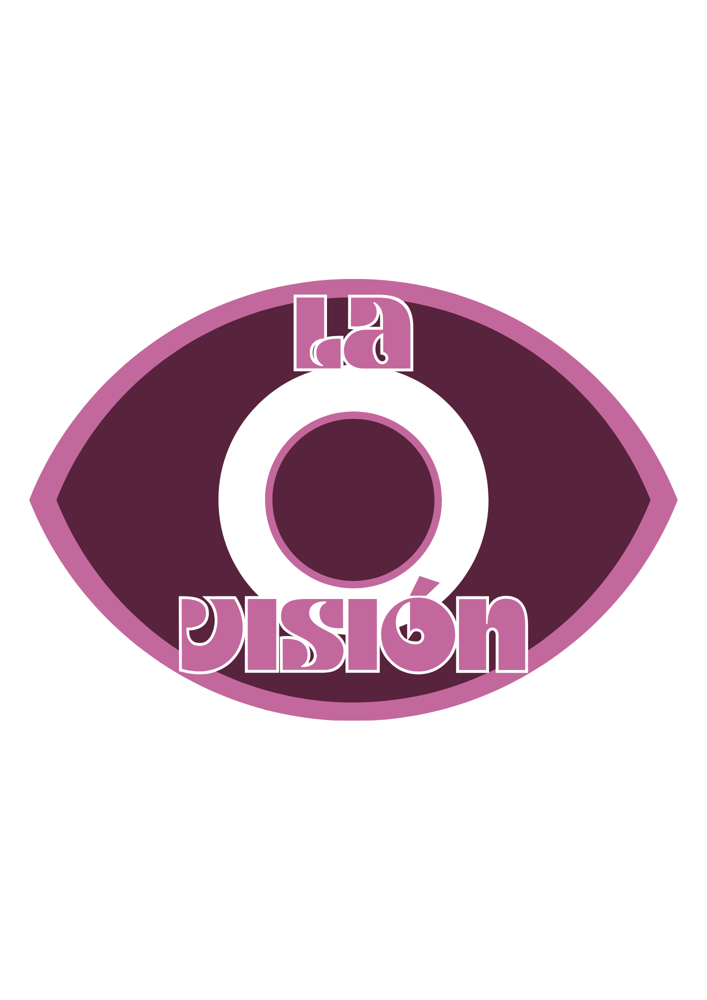
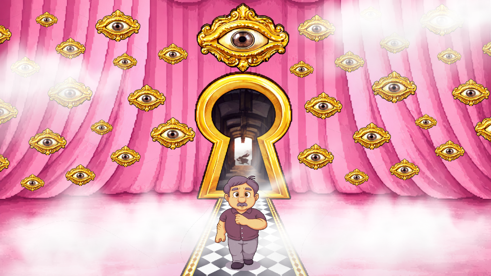
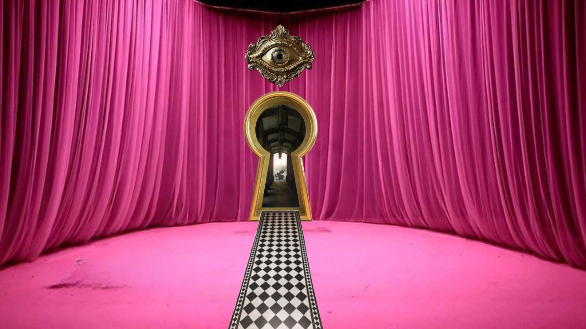
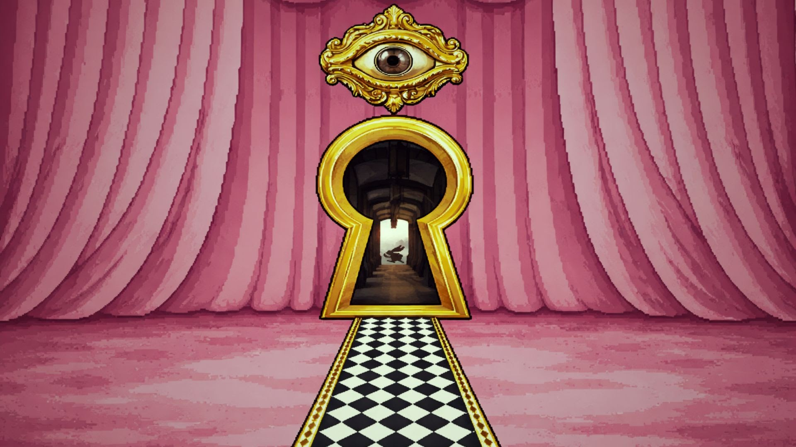

<!-- _coverpage.md -->

# LA VISION
 

<!---- Portada ----> 

### Enlace a Itch.io: https://esalvablancogougres.itch.io/la-visin

#### Facultad de Bellas Artes. Universidad de Granada, 202X

# 1 Datos 

**Titulo** : La Vision

**Web:**   (https://github.com/salvaablanco-blip/LaVisionProyecto.git)

**Autor:**  Salvador Blanco Quesada

 [Profile Card](cmi-card.html)  [Alternate Profile Card](cmi-card2.html)

**Resumen** : Este proyecto busca contar las hitorias de migrantes jóvenes, siendo ellos mismos los protagonistas. Esta será una compilación de relatos y crónicas de sus experiencias, exponiendo su lucha de identidad y sentido de pertenencia, herencia migratoria, entre otros temas que abrirán un debate del tema.

**Estilo/género:**  ScapeRoom

**Logotipo** : (insertar imagen y breve justificación, si  tiene) 

(insertar imágenes a resolucion de 100px alto)

**Resolución:** 1152x648px responsivo/o tamaño fijo 

**Probado en:** Google Chrome

**Tamaño proyecto:** 14MB 

**Licencia** Este proyecto tiene una Licencia CC Reconocimiento Compartir igual (CC BY-SA)

**Fecha** : 28/05/2026

**Medios** 

- Github:
- Itch.io

# 2. Memoria del proyecto 

### 2.1 Storyboard: 

He realizado un videojuego titulado La Visión, una propuesta narrativa y simbólica en la que el jugador acompaña al personaje de Lolo en su entrada a una enorme casa laberíntica. Desde el inicio, el espacio se presenta como un lugar ambiguo y misterioso, donde cada habitación esconde fragmentos de información y pequeñas señales que deben ser descubiertas. El 
objetivo principal del juego consiste en explorar las distintas estancias y encontrar pistas en forma de ojos. Estos ojos, al ser pulsados, revelan números y pequeñas indicaciones que el jugador debe interpretar para construir una serie numérica. Dicha serie será clave para encontrar la llave que permite abrir la casa y, finalmente, acceder a un cofre final que simboliza la resolución del recorrido. 

Sin embargo, el proceso no es lineal ni seguro. Entre los distintos ojos que aparecen en las habitaciones, existe uno que rompe la lógica del juego: el ojo del conejo mágico. Si el jugador 
lo selecciona por error, la partida termina y Lolo muere, obligando a empezar de nuevo. Este elemento introduce tensión y convierte la exploración en una experiencia de riesgo, donde la observación y la intuición resultan fundamentales. 

A nivel estético, el videojuego está inspirado en universos como Alicia en el País de las 
Maravillas o la película Rainbow de Paco León, tomando de ambos ese carácter onírico, 
colorista y ligeramente inquietante. Los espacios tienen una lógica surrealista, donde los 
objetos parecen cargados de significado y las proporciones se alteran para generar una sensación de extrañeza constante. Esta estética no es solo decorativa, sino que refuerza la idea central del juego. 

Conceptualmente, he intentado simbolizar un recorrido introspectivo. Lolo debe encontrar 
todos los ojos que lo observan, lo que funciona como una metáfora de la sensación de ser visto como alguien extraño dentro de un entorno cerrado. La casa representa un espacio mental o social donde el personaje se mueve intentando comprender quién lo mira, quién lo juzga y qué significan esas miradas. Cada ojo descubierto supone reconocer una de esas presencias. 

El conejo, por su parte, simboliza la distracción, la tentación de seguir un camino 
aparentemente mágico pero que conduce al error. Representa aquello que desorienta, lo imprevisible que rompe el proceso de autoconocimiento. Al elegirlo, el jugador no solo pierde 
la partida, sino que se enfrenta a la idea de que no todas las miradas conducen a la verdad; algunas llevan a la confusión o a la desaparición del propio sujeto. 

En conjunto, La Visión se plantea como una experiencia de exploración simbólica donde la mecánica de juego, la estética surrealista y el significado narrativo se unen para hablar de la identidad, la observación y la sensación de extrañeza dentro de un espacio que, aunque 
cerrado, es profundamente psicológico. 

### 2.2. Esquema de navegación 

(imagen con las distintas pantallas de navegación, usa draw.io o cualquier programa de dibujo)

# 3. Metodología

Metodología de desarrollo de productos multimedia basado en una metodología de UX (User Experience)

## Etapa 1: Ideación de proyecto

**Investigación de campo** (propuestas inspiradoras para el proyecto)

1. Pine Studio
Este estudio croata revolucionó el género al trasladar con precisión milimétrica la física y la interacción de una habitación real al entorno virtual. Su gran obra maestra permite registrar cajones, romper objetos e incluso que la comunidad diseñe sus propios niveles.Información del Estudio: Conoce más sobre sus proyectos en la Página Oficial de Pine Studio.Videojuego Referencia: Puedes jugar a su gran éxito cooperativo y de simulación a través de la ficha de Escape Simulator en Steam.
2. Fireproof Games
Fueron los encargados de demostrar que un juego de puzles tridimensionales e interacción mecánica podía ser increíblemente inmersivo. Su saga destaca por una atmósfera oscura y cajas de rompecabezas victorianas repletas de compartimentos ocultos.Información del Estudio: Explora su trayectoria y arte en la Web de Fireproof Games.Videojuego Referencia: Comienza el viaje de misterio mecánico adquiriendo el galardonado The Room en Steam.
3. Total Mayhem Games
Este estudio con sede en los Países Bajos se enfoca de manera única en la comunicación grupal. Su famosa saga encierra a dos jugadores en diferentes salas de un castillo helado, obligándoles a describirse mutuamente lo que ven mediante un walkie-talkie para poder escapar.Información del Estudio: Revisa su catálogo completo en el portal de Total Mayhem Games.Videojuego Referencia: Puedes probar su concepto de manera totalmente gratuita descargando el episodio piloto de We Were Here en Steam.
4. Rusty Lake
Este estudio independiente es famoso por crear un universo interconectado de estilo surrealista y lúgubre, fuertemente inspirado en la serie Twin Peaks. Combinan el formato clásico point-and-click con mecánicas puras de escape room.Información del Estudio: Sumérgete en su misterioso universo visitando el portal de Rusty Lake.Videojuego Referencia: Disfruta de su antología clásica de puzles en una sola colección a través de la Cube Escape Collection en Steam.

**Motivación de la propuesta** 

Este  proyecto es interesante porque muestra como puedes vivir un mundo paralelo atraves de una vision y una serie de pruebas de memoria.

**Publico / audiencia**

- Orientado a personas que les gusten los juegos numericos, memoria o de acertijos.

## Etapa 2: Desarrollo / actividades realizadas

- Pantalla inicial con animacion
- Video
- Menu interactivo con 3 opciones de boton
- Boton 1: Play game
- Boton 2: Creditos
- Boton 3: Contexto
- Boton 4: Galeria (personaje 360)
- Intruciones
- Juego
- Frame final

## Etapa 3: Problemas identificados

En el enlace de itch.io no se ve la tipografia e iconos correctamente. El final no he podido desarrrollarlo aunque el juego si que se resuelve con exito.

# 4. Conclusiones 

El mayor reto ha sido poner el juego debido a que tiene mucha complicacion en los codigos ya que cuenta con uno concreto para cada habitacion del juego, tambien me ha costado el diseño de personaje y animacion. Una de las cosas que me ha dado muchos problemas es el sonido pero aun asi estoy muy contento con el resultado y el esfuerzo.

# 5 Referencias 

**Recursos y materiales audiovisuales:**

* Imágenes:
  Cree las imagenes apartir de un diseño simple en photoshop y luego lo diseñe con procreate para terminar con la edicion del dibujo mediante un filtro estilo videojuego.
  
Idea de diseño:

<!---- Portada ----> 

Resultado final

<!---- Portada ----> 

Para el personaje diseñe varios modelos pero finalmente me quede con Lolo un personaje que fusiona la tonalidad rosa y lo onirico con la ternura de un anciano que tiene visiones.

<!---- Portada ----> 

* Video:

<!---- Portada ----> 

**Herramientas utilizadas**

- Godot Engine 4.x

(imagen de la licencia, copiar y pegar aquí la correcta)
https://creativecommons.org/licenses/?lang=es

* logos en https://creativecommons.org/mission/downloads/
  
  </small>

Mayo 202X
